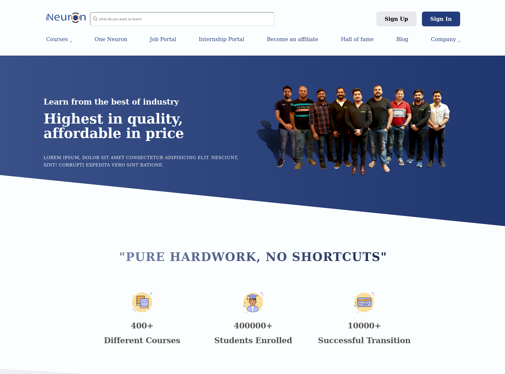
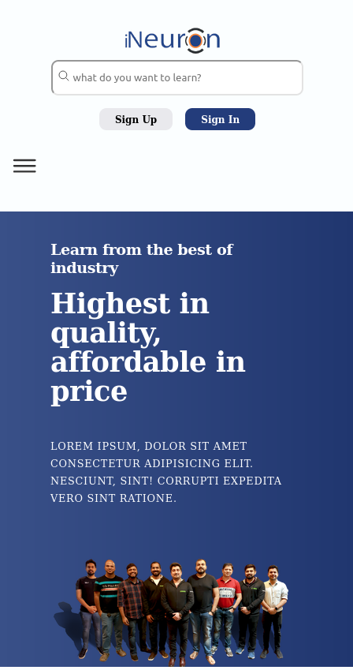

# PROJECT - Ineuron-Landing CLONE

This is a clone of Ineuron website, a build with html5 and css3.

## Table of contents

- [Overview](#overview)
  - [Screenshot](#screenshot)
  - [Links](#links)
- [My process](#my-process)
  - [Built with](#built-with)
  - [Time required](#time-required)
  - [What I learned](#continues-development)
  - [Useful resources](#useful-resources)
- [Author](#author)
- [Acknowledgments](#acknowledgments)

## Overview

### Screenshot





### Links

- Code File URL: [github.com](https://github.com/Jyotimoykathar/heckathone)
- Live Site URL: [netlify.app](https://ineuron-landing.netlify.app/)

## My process

### Built with

- Semantic HTML5 markup
- Css3 and Media-queries

### Time required

3 days required till completion.

### What I learned

This is the customize reusable classes code snippet that helped a lot and saved my time.

```css
.container {
  max-width: 120rem;
  padding: 0 3.2rem;
  margin: 0 auto;
}

/* grid-section */
.grid {
  display: grid;
  column-gap: 6.4rem;
  row-gap: 9.6rem;
  /* align-items: center; */
}
.grid--2-cols {
  grid-template-columns: repeat(2, 1fr);
}
.grid--3-cols {
  grid-template-columns: repeat(3, 1fr);
}
.grid--4-cols {
  grid-template-columns: repeat(4, 1fr);
}
.grid--5-cols {
  grid-template-columns: repeat(5, 1fr);
}

/* flex-section */
.flex-col {
  display: flex;
  flex-direction: column;
  justify-content: center;
  align-items: center;
  gap: 2rem;
}
.flex-row {
  display: flex;
  flex-wrap: wrap;
  flex-direction: row;
  justify-content: center;
  align-items: center;
  gap: 2rem;
}
```

### Continued development

Animation and JS need to be added to make the page more interactive and beautiful.

### Useful resources

- [MDN](https://developer.mozilla.org/en-US/) - This MDN doc. was very helpful while creating the entire project.
- [ION ICONS](https://ionic.io/ionicons) - This is an amazing website with open source icons that helps to add icons easily to your webpages.

## Author

- Github page- [Jyotimoykathar](https://github.com/Jyotimoykathar/)

## Acknowledgments

Special Thanks to Ineuron team for the Project to learn and improve my Css3 and Media-queries skills .
